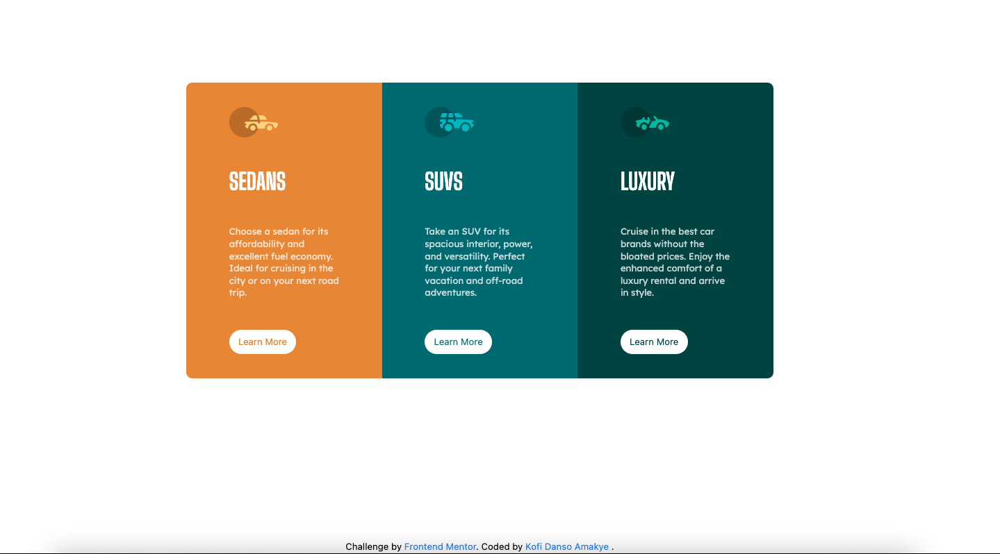

# Frontend Mentor - 3-column preview card component solution

This is a solution to the [3-column preview card component challenge on Frontend Mentor](https://www.frontendmentor.io/challenges/3column-preview-card-component-pH92eAR2-). Frontend Mentor challenges help you improve your coding skills by building realistic projects. 

## Table of contents

- [Overview](#overview)
  - [Screenshot](#screenshot)
  - [Links](#links)
- [My process](#my-process)
  - [Built with](#built-with)
- [Author](#author)
- [Acknowledgments](#acknowledgments)

## Overview

### Screenshot



### Links

- Solution URL: [(https://github.com/Kofiastro/Chat-app-CSS-illustration)]
- Live Site URL:[(https://spiffy-peony-412440.netlify.app/)]

## My process
Using Tailwindcss i have been able to work on designs much faster and i want to learn more by working on more projects at frontendmentor to help me be good at it.

### Built with

- TailwindCss with grids

### What I learned

8th Project using TailwindCSS.So far so good.I had issues making all text in each column align with each other.I used grid instead of lfex in this case and it worked out very well.The code below shows the code description

```html
 <div class="flex justify-center items-center h-screen">
      <!--Grid_Container-->
        <div class="grid md:grid-cols-3 mt-12 md:m-0 ">
```
## Author

- Frontend Mentor - [@Kofiastro](https://www.frontendmentor.io/profile/kofiastro)

## Acknowledgments

Big thanks to Traversy Media and the frontendmentor team 🎉

